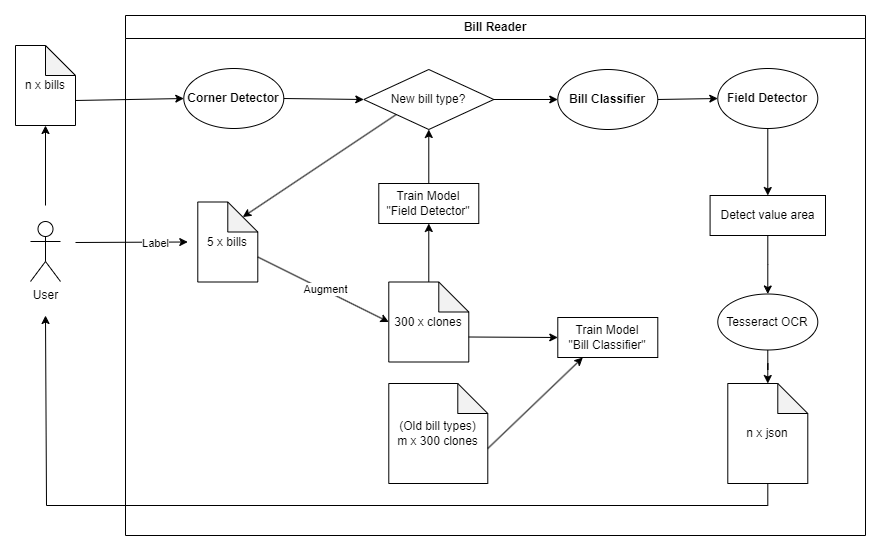

# 🧾 Bill Reader using CNNs and OCR

This project focuses on detecting and extracting key fields from bills using a combination of Object Detection (YOLO) and Optical Character Recognition (OCR) techniques. The system identifies relevant information fields on the bill image and extracts their corresponding values with high accuracy.

## 🚀 Features

- **Accurate Object Detection**: Detects fields on the bill using the YOLO model.
- **Efficient OCR**: Extracts the text from the detected fields using OCR (Pytesseract).
- **User-Friendly Interface**: A simple and intuitive web-based interface for uploading and processing bills.
- **Fast Processing**: Quickly extracts data from bills, reducing the need for manual entry.

## 🛠️ Technologies Used

- **Object Detection**: YOLO (You Only Look Once) model for detecting key fields on the bill.
- **Optical Character Recognition (OCR)**: Pytesseract for extracting text from the detected areas.
- **Backend Framework**: Flask for handling requests and managing the API.
- **Libraries**: 
  - `ultralytics` (for YOLO integration)
  - `pytesseract` (for OCR)
  - `opencv-python` (for image processing)

## 👓 Flow Visualization


## 📁 Project Structure

```bash
├── /corner_detector.py   # YOLO model for detecting field boundaries
├── /value_extractor.py   # OCR script for extracting text from fields
├── /bill_classifier_model.py # CNN-based model for classifying bill types
├── /static               # Static assets (CSS, images, etc.)
├── /templates            # HTML templates for the web interface
├── /app.py               # Main Flask app
```

## 🌟 Key Models
**Corner Detector**:
Detects the boundaries of the fields in the bill image using the YOLO model.

**Value Extractor**:
Uses OCR (Pytesseract) to extract the values of detected fields. This includes parsing text from images to structured data like names, dates, amounts, etc.

**Bill Classifier**:
Classifies the type of bill (e.g., utility, telecom, etc.) based on the content and format using a Convolutional Neural Network (CNN).

## 🖥️ Screenshots
**1. Home Page**

**2. Login Page**

**3. Upload and Detect Bill**

**4. View Results**

## 📖 How It Works
Upload a Bill: The user uploads a scanned image of the bill through the web interface.
Detect Fields: The system processes the image using the YOLO model to detect the relevant fields such as date, amount, and billing information.
Extract Values: OCR is applied to the detected fields to retrieve text data.
Classify Bill: The CNN model classifies the bill type, improving system adaptability to different formats.

## 🧑‍💻 Usage
To run the project locally, follow these steps:

**1. Clone the Repository**
```bash
git clone https://github.com/yourusername/yourrepository.git
cd yourrepository
```
**2. Install Dependencies**
```bash
pip install -r requirements.txt
```
**3. Run the Application**
```bash
python app.py
```
**4. Access the Web Interface**
Navigate to http://127.0.0.1:5000/ in your browser to access the bill reader.

## 📜 Sample Output
Below is an example of the detected and extracted fields from a bill:

Field	Extracted Value
Company Name	ABC Utilities
Invoice Date	01/10/2024
Total Amount	$150.75
Due Date	15/10/2024
## 🚧 Future Improvements
Model Optimization: Further optimization of YOLO and OCR models for speed and accuracy.
Additional Languages: Expand OCR support to handle multilingual bills.
Custom Template Support: Allow users to upload new templates for different bill formats.
## 🤝 Contributions
Contributions are welcome! If you'd like to contribute, please create a pull request or open an issue.

## 📄 License
This project is licensed under the MIT License.

### How to Use:

- Replace the image paths (`./path_to_image1.png`) with the correct paths to your screenshots.
- You can modify the table structure, sample outputs, and sections like **Future Improvements** to better reflect your project roadmap.

Feel free to adjust and personalize this script further for your needs!
